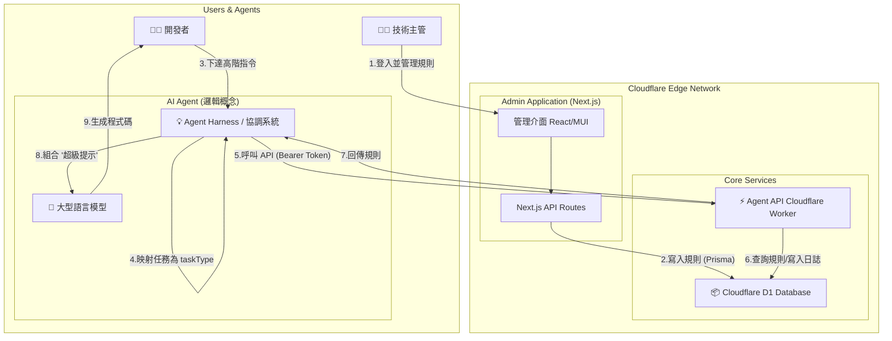

# MCP Server - Architecture Document

*   **Status**: `Final`
*   **Version**: `1.0.0`
*   **Author**: AI Assistant

## 1. Context

為了提升大型軟體專案中 AI Agent 生成程式碼的品質與一致性，我們需要一個系統來動態地提供「開發最佳實踐」與「專案規範」。這個系統必須允許技術主管輕鬆管理這些規則，並為 AI Agent 提供一個高效、低延遲的介面來查詢這些規則。本文件描述了這個「模型內容協議 (MCP) 伺服器」的宏觀架構設計與關鍵決策。

## 2. High-Level Architecture

我們採用基於 Cloudflare Edge 網路的無伺服器 (Serverless) 架構，將系統劃分為兩個主要部分：供人類管理員使用的「管理應用」和供 AI Agent 使用的「核心 API」。

### 2.1. Architecture Diagram

### 2.2. Component Descriptions

*   **Admin Application (Next.js on Cloudflare Pages)**:
    *   **描述**: 這是一個部署在 Cloudflare Pages 上的 Next.js 應用，提供了一個完整的 Web 管理介面。
    *   **職責**: 提供人性化的 CRUD 操作介面、處理管理員身份驗證。

*   **Agent API (Cloudflare Worker)**:
    *   **描述**: 這是一個運行在 Cloudflare 全球邊緣節點上的 Worker，負責處理來自 AI Agent 的所有 API 請求。
    *   **職責**: 提供 `/context`, `/discover`, `/health` 三個核心端點、驗證 API Token、異步記錄請求日誌。

*   **Database (Cloudflare D1)**:
    *   **描述**: 一個基於 SQLite 的無伺服器 SQL 資料庫。
    *   **職責**: 持久化儲存所有的 `Rule`（規則）和 `HistoryLog`（歷史紀錄）資料。

*   **AI Agent Harness (協調系統)**:
    *   **描述**: 這不是本專案交付的實體，而是 **MCP 伺服器的核心使用者**。它是一個邏輯元件，負責協調使用者指令、MCP 規則和大型語言模型 (LLM)。
    *   **職責**: 解析使用者指令、將任務映射到具體的 `taskType`、與 MCP 伺服器通訊、組合最終提示 (Prompt) 給 LLM。

## 3. System Flows

### 3.1. 管理員規則維護流程

1.  **登入**: 技術主管使用預設的帳號密碼，透過瀏覽器登入 Next.js 管理介面。
2.  **操作**: 在介面上，管理員可以瀏覽、新增、修改或刪除規則。例如，新增一條 `taskType` 為 `angular-data-table` 的規則。
3.  **儲存**: 所有操作透過 Next.js 的後端 API (BFF) 進行處理，並使用 Prisma 將變更寫入 Cloudflare D1 資料庫。

### 3.2. AI Agent 互動與程式碼生成流程

這是系統的核心工作流程，完整展示了 MCP 伺服器如何賦能 AI Agent。

1.  **使用者下達指令**: 開發者對 AI Agent 下達一個高層次的指令，例如：「幫我建立一個頁面來顯示使用者訂單列表」。

2.  **Harness 進行任務分析**: AI Agent 的協調系統 (Harness) 接收到指令後，**並非**直接將其拋給 LLM。它會執行內部的一系列分析：
    *   **關鍵詞分析**: 從指令中提取「列表 (list)」、「顯示 (display)」、「訂單 (orders)」等關鍵詞。
    *   **上下文分析**: 檢查當前的專案環境，例如 `package.json` 中是否包含 `@angular/core`，或 `pom.xml` 中是否有 `spring-boot-starter`。

3.  **Harness 映射 `taskType`**: 基於分析結果，Harness 會在其內部配置或決策邏輯中，將任務映射到一個具體的 `taskType`。例如，當「列表」關鍵詞和「Angular 專案」上下文同時滿足時，它會決定要使用的 `taskType` 是 `angular-data-table`。

4.  **Harness 呼叫 MCP API**: Harness 使用預先配置好的 API Token，向 Cloudflare Worker 部署的 `/context` 端點發起一個 GET 請求。
    *   `GET /context?taskType=angular-data-table`
    *   `Authorization: Bearer <AGENT_API_TOKEN>`

5.  **MCP 伺服器處理**:
    *   Cloudflare Worker 驗證 Bearer Token。
    *   使用 Prisma 從 D1 資料庫中查詢 `taskType` 為 `angular-data-table` 且狀態為啟用的規則。
    *   **異步記錄**: 使用 `context.waitUntil()`，將本次請求的來源、`taskType` 和即將回傳的內容非同步地寫入 `HistoryLog` 表中。
    *   將查詢到的規則 `content` (一個 JSON 物件) 作為回應 Body，同步回傳給 Harness。

6.  **Harness 組合「超級提示 (Super Prompt)」**: Harness 收到 MCP 回傳的 JSON 規則後，將其與使用者的原始指令、以及它自己分析出的其他上下文，動態地組合一個內容極其豐富、指令極其明確的「超級提示」。

7.  **LLM 生成程式碼**: Harness 將這個「超級提示」發送給底層的大型語言模型 (LLM)。由於提示中包含了來自 MCP 的精確實踐和程式碼範本，LLM 能夠生成高度符合專案規範的程式碼。

8.  **完成**: 生成的程式碼被呈現給開發者，完成了一次高品質、高效率的開發任務。

## 4. Architecture Decision Records (ADRs)

### ADR-001: 採用 Serverless Edge 技術棧

*   **決策**: 使用 **Next.js, Cloudflare Workers, Prisma, 和 Cloudflare D1** 作為核心技術棧。
*   **用途**:
    *   **Next.js**: 用於快速開發功能完整且體驗現代化的**管理介面**。
    *   **Cloudflare Workers**: 用於部署**核心 Agent API**。其邊緣計算特性確保了全球 AI Agent 都能獲得最低的 API 請求延遲。
    *   **Prisma**: 作為 **ORM**，提供從 Next.js 和 Worker 到資料庫的端到端類型安全，大幅提升開發效率與程式碼健壯性。
    *   **Cloudflare D1**: 作為**無伺服器資料庫**，與 Worker 原生整合，簡化了資料庫的部署、管理與連線。

### ADR-002: 設計雙重認證模型

*   **決策**: 為管理介面使用**預設帳號密碼**，為 Agent API 使用**靜態 Bearer Token**。
*   **用途**:
    *   **預設帳號密碼**: 為人類管理員提供一種簡單、有狀態的登入機制，以保護後台管理功能。
    *   **Bearer Token**: 為自動化的 AI Agent 提供一種無狀態、標準化的 API 認證方式，確保所有對外服務的請求都經過授權。

### ADR-003: 實施異步日誌記錄

*   **決策**: 在 Cloudflare Worker 中，使用 `context.waitUntil()` 方法來執行寫入 `HistoryLog` 資料表的資料庫操作。
*   **用途**: 確保**日誌記錄過程不會阻塞或延遲對 AI Agent 的 API 回應**。這將 API 效能最大化，同時保證了請求歷史的可追蹤性與可審計性，是兼顧效能與功能需求的最佳實踐。